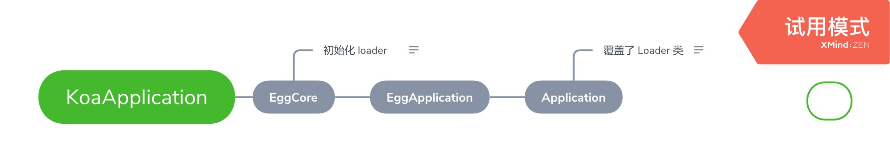
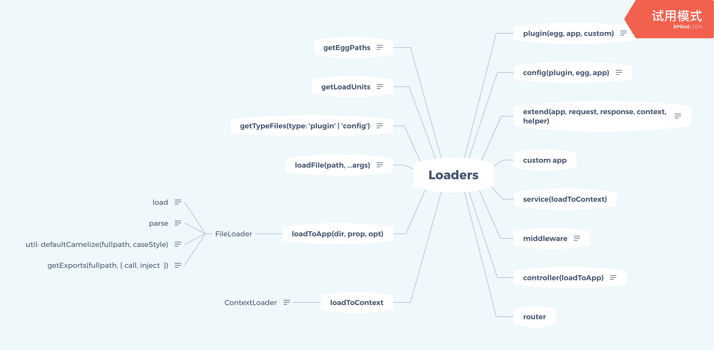

# egg core 源码解读

egg core 是 egg 框架的核心，本文主要对其动态加载的思路进行解读。

## egg 的继承关系



egg 是基于 koa， EggCore 直接继承 KoaApplication，EggApplication、Application 和 Agent(和本文关系不大，图中未画)
都是写在 egg 这个 npm 包里面的，EggApplication 是 Application 和 Agent(与本文联系不大，图中未画出) 的父类，继承于 EggCore。

Loader 的初始化是在 EggCore 的 constructor 完成的\[[code](https://github.com/eggjs/egg-core/blob/b958870c6f9a71ea70dcbef7c63366f5ca6d5f83/lib/egg.js#L116)\]，但是 Application 用 AppWorkerLoader 覆盖了 Loader 类\[[code](https://github.com/eggjs/egg/blob/e899630e97865701b81d428686a19288b1c87b98/lib/application.js#L82)\]，先在 EggApplication 的 constructor 中调用 this.loader.loadConfig() \[[code](https://github.com/eggjs/egg/blob/e899630e97865701b81d428686a19288b1c87b98/lib/egg.js#L51)\]，再在  Application 的 constructor 中调用 this.loader.load() \[[code](https://github.com/eggjs/egg/blob/e899630e97865701b81d428686a19288b1c87b98/lib/application.js#L66)\]，完成所有内容的加载。

## egg loader



loader 的核心是 EggLoader 类，每个模块的 load 方法通过 mixin 混合进 EggLoader 的原型 \[[code](https://github.com/eggjs/egg-core/blob/b958870c6f9a71ea70dcbef7c63366f5ca6d5f83/lib/loader/egg_loader.js#L459)\]

加载的流程：获取所有需要加载的文件的路径 => 加载所有文件，获取所有的导出 => 绑定到对应的对象上

### 获取所有需要加载的文件的路径

Egg 的应用是 app + plugins + egg framework 组成的，每一个 package 都视为一个加载单元，用不同的 type(plugin, framework, app) 区分。

每次加载文件时，都会先调用 [getLoadUnits()](https://github.com/eggjs/egg-core/blob/b958870c6f9a71ea70dcbef7c63366f5ca6d5f83/lib/loader/egg_loader.js#L337) 获取到所有的加载单元，在 join 约定好的目录结构,获取到所有的目录，在遍历所有的目录，拿到所有需要加载的文件的路径。

加载配置项的时候，egg 通过 [getTypeFiles(filename: 'config'|'plugin')](https://github.com/eggjs/egg-core/blob/b958870c6f9a71ea70dcbef7c63366f5ca6d5f83/lib/loader/egg_loader.js#L428) 方法得到不同环境下需要加载的文件，在依据重要程度合并配置项，在加载其他内容的时候，egg 通过 [glob](https://github.com/isaacs/node-glob) 获取到文件下所有的 js 文件。

> 比如
> serverScope=online
> serverEnv=prod // egg 的
>
> getTypeFiles('config') =>
>[
>
> 'config.default',
>
> 'config.online',
>
> 'config.prod',
>
> 'config.online_prod'
>
> ]

加载单元中，app 是确定的，egg framework 由于可以继承，其加载单元不是唯一的，egg 通过 [getEggPaths()](https://github.com/eggjs/egg-core/blob/b958870c6f9a71ea70dcbef7c63366f5ca6d5f83/lib/loader/egg_loader.js#L249) 递归遍历收集原型上的 `Symbol(egg#eggPath)` 属性。egg plugin 分为 egg 自带的 core plugin (已知)和用户自己使用的 plugin (未知)，所以 egg 会先通过 `loadConfig()` 先加载用户的 plugin 配置项，得到所有需要需要加载的 plugin。

### 文件加载

egg 支持文件多种导出，[EggLoader#loadFile](https://github.com/eggjs/egg-core/blob/b958870c6f9a71ea70dcbef7c63366f5ca6d5f83/lib/loader/egg_loader.js#L293) 和 [FileLoader#getExports](https://github.com/eggjs/egg-core/blob/b958870c6f9a71ea70dcbef7c63366f5ca6d5f83/lib/loader/file_loader.js#L198) 都有相似的逻辑。都是先调用 [utils#loadFile](https://github.com/eggjs/egg-core/blob/b958870c6f9a71ea70dcbef7c63366f5ca6d5f83/lib/utils/index.js#L19) 加载文件，然后会根据不同的情况处理。如果导出是 class 或者 generator 时，直接返回 exports，如果导出的时函数，会直接调用函数，传入 app，config，返回函数的返回值。文件名会通过 [defaultCamelize](https://github.com/eggjs/egg-core/blob/b958870c6f9a71ea70dcbef7c63366f5ca6d5f83/lib/loader/file_loader.js#L230) 方法格式化。

```js
// utils/index.js
loadFile(filepath) {
  try {
    // 获取文件后缀名，判断文件是否是 Node 可以解析的文件
    const extname = path.extname(filepath);
    if (extname && !require.extensions[extname]) {
      // 无法解析的文件，直接读取返回 Buffer
      return fs.readFileSync(filepath);
    }
    const obj = require(filepath);
    if (!obj) return obj;
    // 判断是否是 es module
    if (obj.__esModule) return 'default' in obj ? obj.default : obj;
    return obj;
  } catch (err) {
    err.message = `[egg-core] load file: ${filepath}, error: ${err.message}`;
    throw err;
  }
}

function getExports(fullpath, { initializer, call, inject }, pathName) {
  // 先加载文件
  let exports = utils.loadFile(fullpath);
  // 支持额外处理每个 export
  if (initializer) {
    exports = initializer(exports, { path: fullpath, pathName });
  }

  // 当导出是 class 或者 generator 时，直接返回 exports
  //
  // module.exports = class Service {};
  // or
  // module.exports = function*() {}
  if (is.class(exports) || is.generatorFunction(exports) || is.asyncFunction(exports)) {
    return exports;
  }

  // 当导出的时函数，会直接调用函数，传入 inject，返回函数的返回值。
  //
  // module.exports = function(app) {
  //   return {};
  // }
  if (call && is.function(exports)) {
    exports = exports(inject);
    if (exports != null) {
      return exports;
    }
  }

  // return exports what is
  return exports;
}
```

### load

load 分为2种，一种是通过 [loadToApp](https://github.com/eggjs/egg-core/blob/b958870c6f9a71ea70dcbef7c63366f5ca6d5f83/lib/loader/egg_loader.js#L399) 直接挂载到 app 对象上， 一种是通过 [loadToContext](https://github.com/eggjs/egg-core/blob/b958870c6f9a71ea70dcbef7c63366f5ca6d5f83/lib/loader/egg_loader.js#L399) 挂载到 context 原型上，需要使用的时候再实例化。

例如: service

```js
// 基本使用
// service/dir1/dir2/demo.js
const Service = require('egg').Service;
class HelloService extends Service {
  async hello() {
    return 'hello world';
  }
}

// controller/demo.js
const Controller = require('egg').Controller;
class HelloController extends Controller {
  async hello() {
    this.ctx.body = this.ctx.service.dir1.dir2.demo.hello();
  }
}
module.exports = UserService;
```

[loadService](https://github.com/eggjs/egg-core/blob/b958870c6f9a71ea70dcbef7c63366f5ca6d5f83/lib/loader/mixin/service.js#L14) 会在 context 定义一个 service 属性的 [getter](https://github.com/eggjs/egg-core/blob/b958870c6f9a71ea70dcbef7c63366f5ca6d5f83/lib/loader/context_loader.js#L62) 函数，当我们访问 `this.ctx.service` 时，触发这个 getter 函数，进入 [getInstance](https://github.com/eggjs/egg-core/blob/b958870c6f9a71ea70dcbef7c63366f5ca6d5f83/lib/loader/context_loader.js#L85) 函数，分支选择实例化一个 ClassLoader, 并返回，所以 `this.ctx.service` 返回的是一个 ClassLoader 实例， ClassLoader 会遍历我们实际使用的 service 对象的所有属性，并代理，当我们继续访问 `this.ctx.service.dir1` 时，触发 [getter](https://github.com/eggjs/egg-core/blob/b958870c6f9a71ea70dcbef7c63366f5ca6d5f83/lib/loader/context_loader.js#L24) 函数，
通过 getInstance 获取到值，并缓存结果。getInstance 判断一个对象是普通的对象，还是用户自己导出的对象是通过 `Symbol('EGG_LOADER_ITEM_EXPORTS')` 判断的，egg 在 loadFile 的时候，[用户导出的对象会绑定一个 Symbol 值](https://github.com/eggjs/egg-core/blob/b958870c6f9a71ea70dcbef7c63366f5ca6d5f83/lib/loader/file_loader.js#L81)

```js
function getInstance(values, ctx) {
  // 判断是否是用户导出的内容还是一个普通的对象
  const Class = values[EXPORTS] ? values : null;
  let instance;
  if (Class) {
    // 如果用户导出的是类，就实例化
    if (is.class(Class)) {
      instance = new Class(ctx);
    } else {
      // 如果用户导出的是对象，就直接返回
      instance = Class;
    }
  // 基础类型的值不能绑定 Symbol 值，需要额外检查一次
  // e.x. module.exports = 1;
  } else if (is.primitive(values)) {
    instance = values;
  } else {
    // 普通的对象，通过 ClassLoader 代理所有的属性
    // 第一次触发 getInstance 的时候，既 this.ctx.service 时，走这个分支
    instance = new ClassLoader({ ctx, properties: values });
  }
  return instance;
}
```

egg 通过 `getInstance` 和 `ClassLoader` 实现了深度的代理。

```js
// 通过 Proxy 实现类似的效果
function getInstance(values, ctx) {
  // 判断是否是用户导出的内容还是一个普通的对象
  const Class = values[EXPORTS] ? values : null;
  let instance;
  if (Class) {
    // 如果用户导出的是类，就实例化
    if (is.class(Class)) {
      instance = new Class(ctx);
    } else {
      // 如果用户导出的是对象，就直接返回
      instance = Class;
    }
  // 基础类型的值不能绑定 Symbol 值，需要额外检查一次
  // e.x. module.exports = 1;
  } else if (is.primitive(values)) {
    instance = values;
  } else {
    // 普通的对象，通过 Proxy 代理所有的属性
    instance = new Proxy(values, {
      get(target, key) {
        const subValues = Reflect.get(target, key);
        return getInstance(subValues, ctx);
      }
    })
  }
  return instance;
}
```

### loaders

#### controller

load controller，egg 通过 [wrapClass](https://github.com/eggjs/egg-core/blob/b958870c6f9a71ea70dcbef7c63366f5ca6d5f83/lib/loader/mixin/controller.js#L57)，递归遍历所有的方法，通过 [methodToMiddleware](https://github.com/eggjs/egg-core/blob/b958870c6f9a71ea70dcbef7c63366f5ca6d5f83/lib/loader/mixin/controller.js#L81)，把方法转换成中间件。

```js
app.controller.home = function classControllerMiddleware(...args) {
  // 实例化 controller
  const controller = new Controller(this);
  // 参数
  if (!this.app.config.controller || !this.app.config.controller.supportParams) {
    args = [ this ];
  }
  // 调用用户定义的方法
  return utils.callFn(controller[key], args, controller);
}
```

#### extend

egg 的 extend 支持 Symbol, getter， setter 函数，在合并用户定义的扩展对象时，先通过 [Object.getOwnPropertyNames 和 Object.getOwnPropertySymbols](https://github.com/eggjs/egg-core/blob/b958870c6f9a71ea70dcbef7c63366f5ca6d5f83/lib/loader/mixin/extend.js#L115) 拿到所有的属性值，在 [拷贝对象的 descriptor](https://github.com/eggjs/egg-core/blob/b958870c6f9a71ea70dcbef7c63366f5ca6d5f83/lib/loader/mixin/extend.js#L125)，进行深度合并。

#### middleware

middleware 可以在 config 设置选项，将作为函数的第一个函数参数传入[\[code\]](https://github.com/eggjs/egg-core/blob/b958870c6f9a71ea70dcbef7c63366f5ca6d5f83/lib/loader/mixin/middleware.js#L73)，如果选项设置了 match 或者 ignore (只能设置一个，不能同时设置)， egg 会依据 url 的 pathname 进行匹配，匹配成功才执行对应的中间件 [\[code\]](https://github.com/eggjs/egg-core/blob/b958870c6f9a71ea70dcbef7c63366f5ca6d5f83/lib/loader/mixin/middleware.js#L107)

#### plugin

plugin 涉及到依赖问题，plugin 需要依据依赖的关系调整加载顺序，相关[代码](https://github.com/eggjs/egg-core/blob/b958870c6f9a71ea70dcbef7c63366f5ca6d5f83/lib/utils/sequencify.js)
